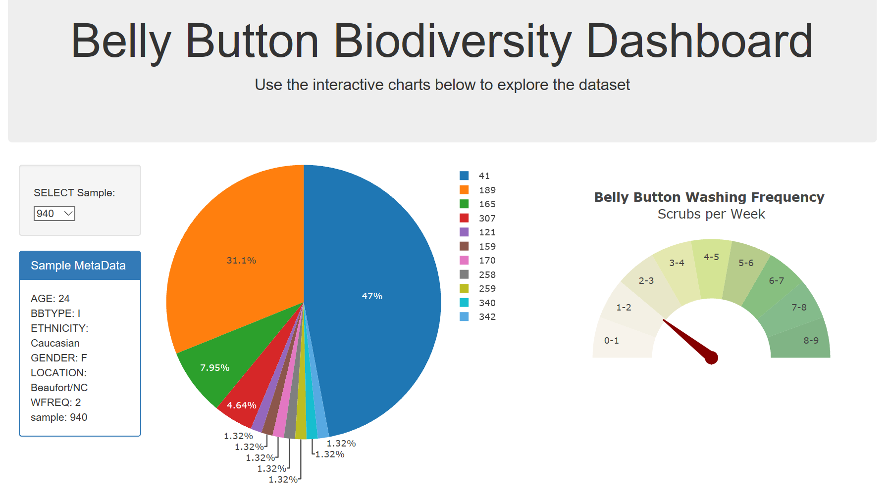
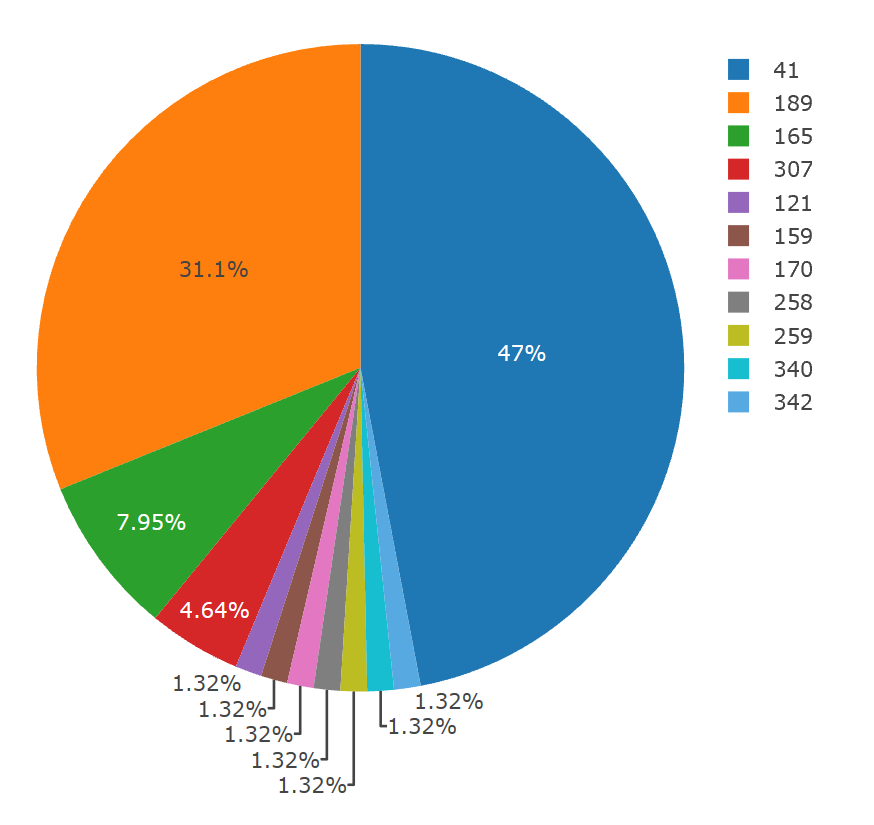
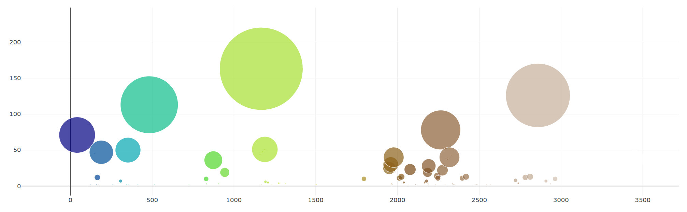
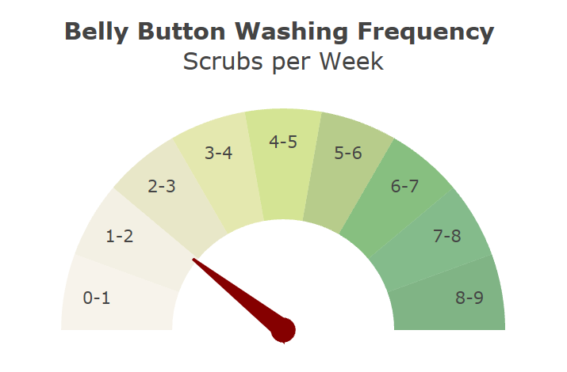

# Belly Button Biodiversity

In this project we will build an interactive dashboard to explore the [Belly Button Biodiversity DataSet](http://robdunnlab.com/projects/belly-button-biodiversity/).

## DASHBOARD

Use Plotly.js to build interactive charts within a dashboard.

Create a Bubble Chart that uses data from your samples route (`/samples/<sample>`) to display each sample.

Display the sample metadata from the route `/metadata/<sample>`

  

Adapt the Gauge Chart from <https://plot.ly/javascript/gauge-charts/> to plot the Weekly Washing Frequency obtained from the route `/wfreq/<sample>`

- - -

